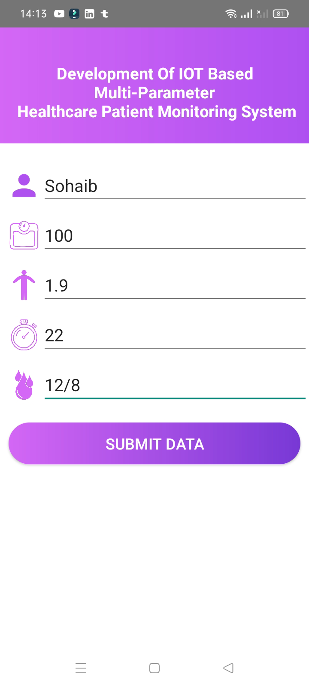
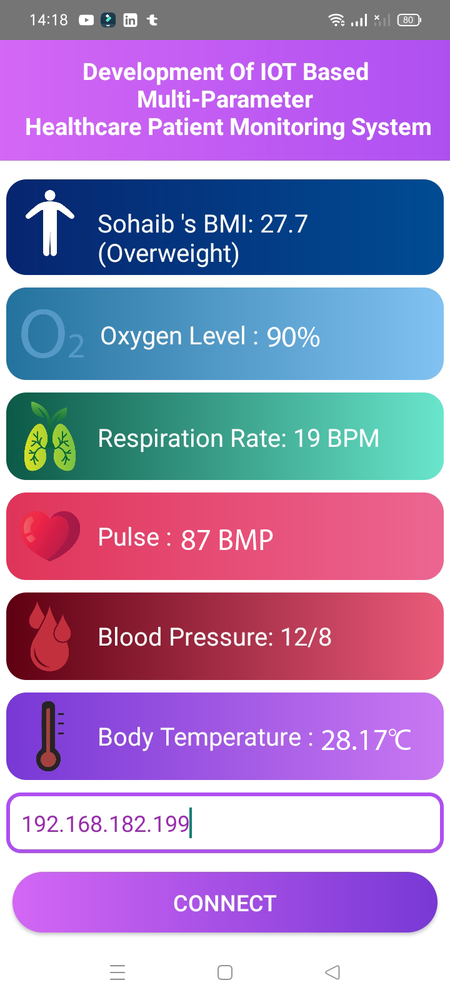
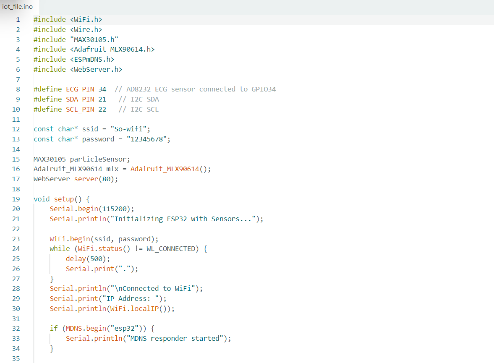

# 🏥 IoT Healthcare Monitoring System

This project involves an **IoT-based healthcare monitoring system** using **ESP32** and **Kotlin**. The system reads patient health data from multiple sensors connected to an ESP32, and sends the data as **JSON** to a Kotlin mobile app which displays the live readings.

> ✅ **Developed by:** Sohaib Raid Rasheed  
> 🏢 **Created during Summer Training at Qi Card**  
> 📱 Kotlin Android App: `app-depug.apk`  
> 🔌 IoT Platform: ESP32

---

---

## 🌐 How It Works

1. **ESP32** collects real-time patient data from connected health sensors.
2. The ESP32 starts a local web server and prints its **IP address**.
3. The **Kotlin Android App** connects to that IP and receives **JSON data**.
4. The app parses and displays the data for monitoring.

---

## 🧠 Sensors Used

| Sensor         | Function                                |
|----------------|-----------------------------------------|
| **MAX30102**   | Measures heart rate and SpO2 (oxygen)   |
| **MLX90614**   | Infrared temperature sensor (non-contact) |
| **AD8232**     | ECG (Electrocardiogram) sensor          |

These sensors provide accurate vital signs for continuous patient monitoring.

---

## 📱 Features

- 📡 Real-time sensor data transmission from ESP32
- 🔥 Non-contact temperature reading
- ❤️ Heart rate and SpO2 monitoring
- 🧠 ECG data collection (AD8232)
- 📲 User-friendly Android interface (Kotlin)
- 🌐 JSON-based communication over Wi-Fi

---

## 🔧 Technologies Used

- **IoT Side**:
  - ESP32 microcontroller
  - Arduino IDE
  - MAX30102, MLX90614, AD8232 sensors
- **Mobile Side**:
  - Kotlin
  - Android SDK
  - JSON parsing

---

## 📁 Project Structure

.
├── iot_file.ino # ESP32 code for sensor data and server
├── app-depug.apk # Android app (Kotlin)

